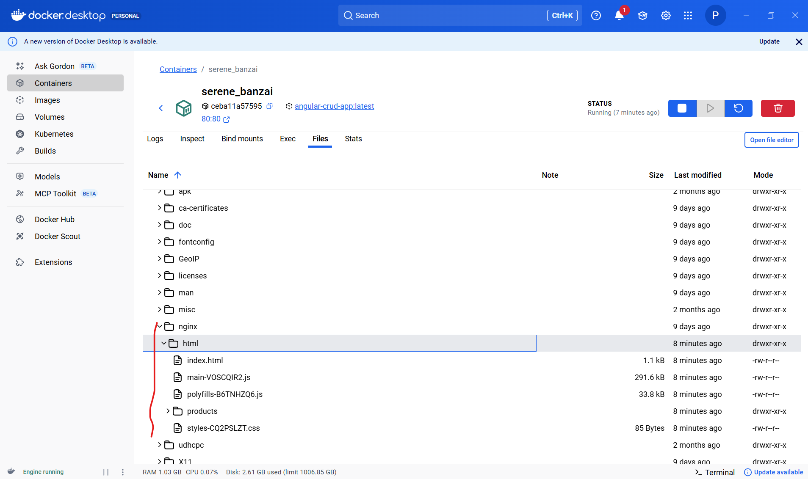
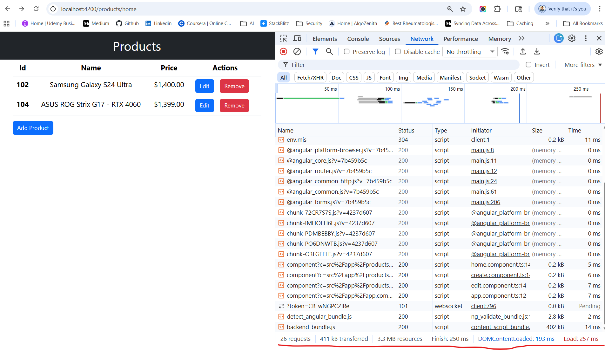
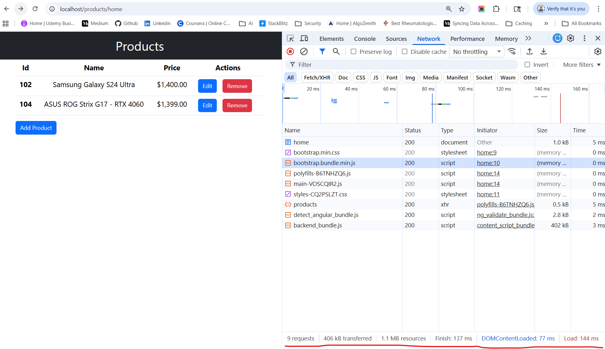
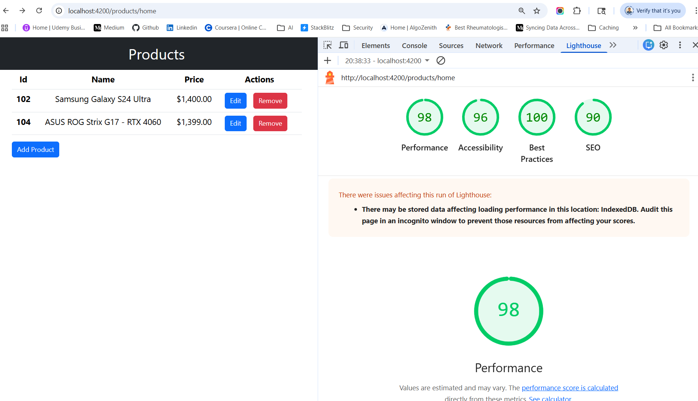
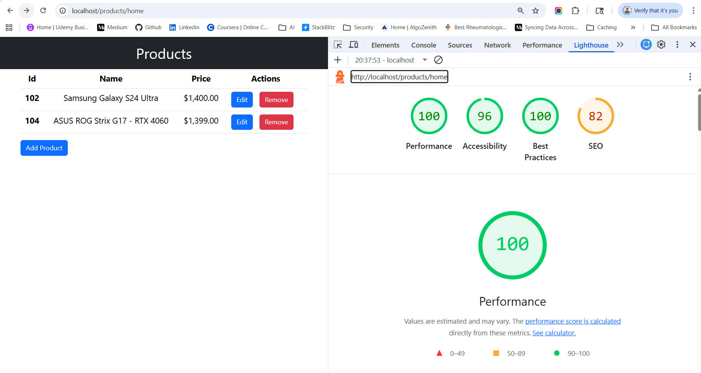

# Angular-Docker-Nginx
Angular 19 + Docker + Nginx for improves Performance

## 🏗️ What I am Doing
```
Angular 19 → Docker build → Nginx serves app → Browser
```

## 🚀Run Your App

**📁 Step 1: Your Project Should Have These Files**

In your Angular repo root:
```
Dockerfile
nginx.conf
.dockerignore
docker-compose.yml (optional)
```
(Use the files I gave you earlier)

**⚙️ Step 2: Build Angular App (inside Docker)**

You DON’T need to run ng build manually — Docker will do it.

**🐳 Step 3: Build Docker Image**

Run this in your project root:
```
docker build -t angular-crud-app .
```

👉 What happens:
- Installs dependencies
- Builds Angular (production)
- Copies files to Nginx

**▶️ Step 4: Run Container**
```
docker run -p 80:80 angular-crud-app
```

**🌐 Step 5: Open in Browser**
```
http://localhost
```
🎉 Your Angular app is now running via Nginx inside Docker

**🧠 Every time you change code:**
```
docker build -t angular-crud-app .
docker run -p 80:80 angular-crud-app
```

**🌐 Step 6: Use backend or json-server to fetch products.json data**
```
npx json-server --watch src/assets/products.json --port 3000
```
Access via URL
```
http://localhost/assets/products.json
```

## ✅ Manually Production Build Output

Run locally:
```
ng build --configuration production
```
👉 You should see something like:
```
dist/angular-crud/
  ├── browser
  ├── server
```
My Application is using SSR/Hybrid build structure

👉 browser/ → frontend static files (what Nginx needs ✅) 
👉 server/ → Node SSR files (not needed for Nginx ❌) 

Angular 19 SSR builds generates:
👉 index.csr.html → for browser (client-side rendering) 
👉 index.server.html → for SSR  

## Nginx store production build files inside Docker container

```
/usr/share/nginx/html/
```
the upper file path is mentioned inside Dockerfile file.

👉 /usr/share/nginx/html/ is inside the Docker container, NOT on your local machine.



| Location                    | Meaning            |
| --------------------------- | ------------------ |
| `/usr/share/nginx/html`     | inside container   |
| `dist/angular-crud/browser` | your Angular build |
| COPY command                | connects both      |

## 🔥 Real Flow
```
Angular build (local)
        ↓
Docker COPY
        ↓
/usr/share/nginx/html (container)
        ↓
Nginx serves to browser
```

## ✅ Let’s Confirm the Container is Running or not

Run this:
```
docker ps
docker exec -it <container_id> sh
```

Then:
```
cd /usr/share/nginx/html
ls -la
```


## Changes needed
**📁 ✅ 1. Add Dockerfile (ROOT)**

Creating a basic docker image

We will optimize the final image size by using a multi-stages build : one stage will rely on the stable nodejs official image (node:lts-slim) to generate the Angular final bundle and one stage will rely on the official nginx image (nginx:stable) to serve the Angular app files. Create a Dockerfile (no extension) and paste this content :

Create a file named Dockerfile in your repo root:
```
# -------- Stage 1: Build Angular --------
FROM node:20-alpine AS build

WORKDIR /app

COPY package*.json ./
RUN npm ci

COPY . .

RUN npm run build -- --configuration production

# -------- Stage 2: Nginx --------
FROM nginx:stable-alpine

# Remove default config
RUN rm -rf /etc/nginx/conf.d/*

# Copy custom nginx config
COPY nginx.conf /etc/nginx/conf.d/default.conf

# Copy Angular build output
COPY --from=build /app/dist/angular-crud/browser /usr/share/nginx/html

EXPOSE 80

CMD ["nginx", "-g", "daemon off;"]
```
👉 🔴 IMPORTANT  
If your dist folder is different, update this line:
```
COPY --from=build /app/dist/YOUR_PROJECT_NAME /usr/share/nginx/html
```

👉 browser/ → frontend static files (what Nginx needs ✅) 
👉 server/ → Node SSR files (not needed for Nginx ❌) 

👉 ✅ CORRECT PATH:
```
COPY --from=build /app/dist/angular-crud/browser /usr/share/nginx/html
```

**📁 ✅ 2. Add nginx.conf (ROOT)**

Create nginx.conf in root:
```
server {
    listen 80;

    server_name localhost;

    root /usr/share/nginx/html;
    index index.html;

    # 🚀 Gzip compression
    gzip on;
    gzip_comp_level 6;
    gzip_types text/plain text/css application/json application/javascript application/xml+rss;

    # 🚀 Cache static assets (1 year)
    location ~* \.(js|css|png|jpg|jpeg|gif|svg|woff2?|ttf|ico)$ {
        expires 1y;
        add_header Cache-Control "public, immutable";
    }

    # 🚀 Do NOT cache index.html
    location = /index.html {
        add_header Cache-Control "no-cache, no-store, must-revalidate";
    }

    # 🚀 Angular routing fix
    location / {
        try_files $uri /index.html;
    }

    location /api/products {
        alias /usr/share/nginx/html/assets/products.json;
        default_type application/json;
    }
}
```

**📁 ✅ 3. Add .dockerignore**

Create .dockerignore:
```
node_modules
dist
.git
.gitignore
Dockerfile
docker-compose.yml
README.md
```

**📁 ✅ 4. (Optional but Recommended) docker-compose.yml**
```
version: '3.8'

services:
  angular-app:
    build: .
    container_name: angular-crud-app
    ports:
      - "80:80"
    restart: always
```

**⚙️ ✅ 5. Update angular.json (VERY IMPORTANT)**

✔️ Correct Production Config (Before Angular 17)
```
"production": {
  "optimization": true,
  "outputHashing": "all",
  "sourceMap": false,
  "namedChunks": false,
  "extractLicenses": true,
  "vendorChunk": false,
  "buildOptimizer": true
}
```

✔️ Correct Production Config (Angular 19)
```
"optimization": true,
  "sourceMap": false,
  "outputHashing": "all",
  "extractLicenses": true
```

## Compare Performance Nginx vs Angular ng build
You have 2 scenarios:

**🟡 Before**
- Angular served via:
  - ng serve OR basic static hosting
- ❌ No compression
- ❌ No caching
Running in : http://localhost:4200/products/home

**🟢 After**
- Angular served via Nginx
- ✅ Gzip/Brotli compression
- ✅ Cache headers
- ✅ Optimized delivery
Running in : http://localhost/products/home

**⚠️ Important Truth**

👉 Bundle size (dist folder) DOES NOT change
```
dist/ size → same ❗
```

👉 What changes:
- Network transfer size
- Load time (LCP, FCP)
- User experience

**✅ Method 1: Compare Network Size (BEST)**
--------------------------------------------------------------------
🔍 Step 1: Run with Nginx:
```
docker run -p 80:80 angular-crud-app
```
Open:
```
http://localhost
```

Open DevTools
- Open your app
- Press F12
- Go to Network tab

🔁 Step 2: Test WITHOUT Nginx

Run:
```
ng serve
```

Open:
```
http://localhost:4200
```

Open DevTools
- Open your app
- Press F12
- Go to Network tab

Compare bottom section of network tab of both tabs




✅ Method 2: Lighthouse (BEST for Score)
------------------------------------------------------------
Run audit:
- Open Chrome DevTools
- Go to Lighthouse tab
- Click Analyze page




📊 Your Results (Clean Comparison)
------------------------------------------------------------
| Metric           | Angular (old) | Nginx (optimized) | Improvement      |
| ---------------- | ------------- | ----------------- | ---------------- |
| Requests         | 26            | 9                 | 🔥 **-65%**      |
| Transferred      | 411 KB        | 406 KB            | ✅ Slightly lower |
| Resources        | 3.3 MB        | 1.1 MB            | 🔥 **-66%**      |
| Finish           | 250 ms        | 137 ms            | 🚀 **-45%**      |
| DOMContentLoaded | 193 ms        | 77 ms             | 🚀 **-60%**      |
| Load             | 257 ms        | 144 ms            | 🚀 **-44%**      |


**🔥 1. Huge Win: Resource Size ↓**
```
3.3 MB → 1.1 MB
```
👉 This is BIG  
👉 Means:
- Better build optimization
- Less JS parsing
- Faster rendering

**🚀 2. Load Time Almost Halved**
```
257 ms → 144 ms
```
👉 That’s real user impact:
- Faster page load
- Better Core Web Vitals

**🔥 3. Requests Reduced (VERY IMPORTANT)**
```
26 → 9
```
👉 Means:
- Better bundling
- Fewer round trips
- Less network overhead
- Less HTTP overhead
- Better mobile performance

**🚀 4. Massive Rendering Improvement**
DOMContentLoaded: 193 ms → 77 ms

👉 ~60% faster UI rendering 
👉 Users see content much quicker 

**🎯 5. Compression is NOW Working**
Transferred: 406 KB ≈ compressed size
Resources: 1.1 MB ≈ actual size

👉 This proves:
- ✅ Gzip is active
- ✅ Files compressed ~60–70%

Check:
```
content-encoding: gzip or br
```